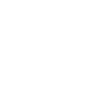
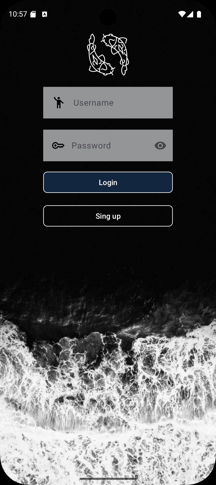
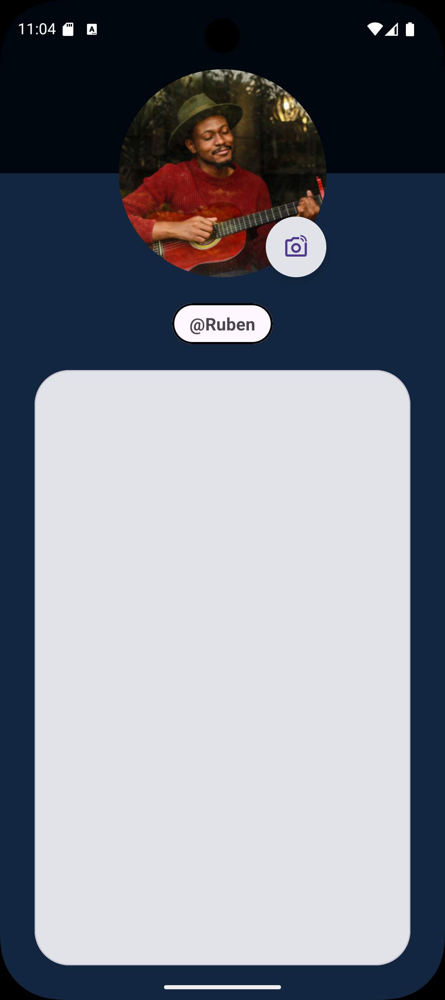
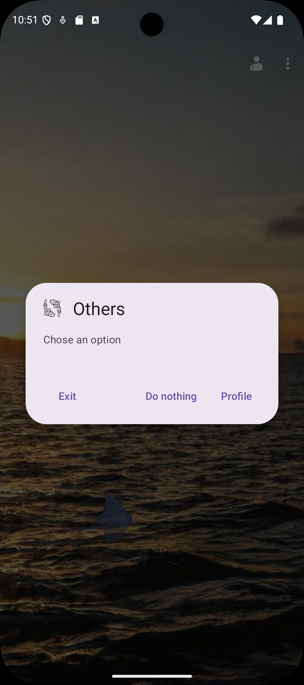
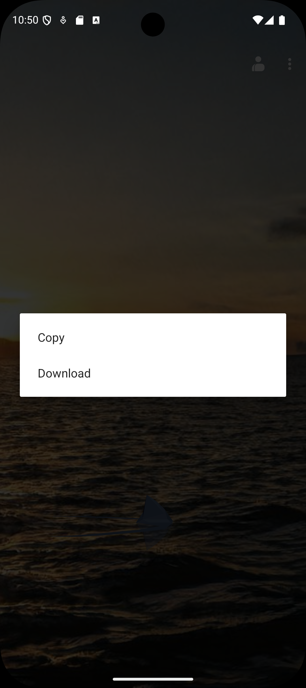

# NiceStart 

Este es un proyecto para la asignatura de Desarrollo de Interfaces. La idea es crear un prototipo de aplicación sencillo para practicar el diseño de layouts.

## Lenguajes
- Java
- XML
- Gradle

## Características técnicas
- ViewBinding: Se utiliza en todas las actividades para reemplazar el findViewById, para evitar null pointers exceptions.
- Persistencia de Datos (SharedPreferences): Se utiliza para guardar el nombre de usuario en un ligero almacenamiento local, y mostrarlo en el perfil.
- WebView Dinámico: La pantalla principal genera código HTML/CSS localmente para incrustar imágenes aleatorias de fuentes externas(thisbeachdoesnotexist).
- Animaciones: Uso de AnimationsUtil y lottie.

## Librerías y Dependencias

| Librería | Uso en el proyecto |
| :--- | :--- |
| Glide | Carga de imágenes remotas (fondos, avatares) con transformación circular (circleCrop) y recorte (centerCrop). |
| SweetAlert | Diálogos modales personalizados y estéticos para mensajes de éxito o error en el Login/Registro. |
| SwipeRefreshLayout | Implementación del gesto "deslizar para actualizar" en la pantalla principal para recargar imágenes. |
| Material Components | Uso de MaterialAlertDialogBuilder y componentes de UI modernos. |
| Lottie | Integración de animaciones vectoriales de alta calidad (JSON). |

## Pantallas de la App

### Vista Vertical

| Login | Sign Up |
| :---: | :---: |
|  |  |
| Main | Profile |
|  |  |

### Functionalitis

| LoginSuccess | LoginError | NavBar | DialogAlert | ContextMenu |
| :---: | :---: | :---: | :---: | :---: |
|  |  |  |  |  |

> **Nota:** El sistema de login valida que los campos no estén vacíos y guarda el nombre de usuario localmente para mostrarlo en el Perfil.

### Animations

| Lottie | Splash | Refresh |
| :---: | :---: | :---: |
|  |  |  |

---

### Paleta de Colores

---

> [!NOTE]
> **Estado del proyecto**:
> Esta app es una práctica de clase que aun no esta finalizada.

