# NiceStart 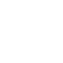

Este es un proyecto para la asignatura de Desarrollo de Interfaces. La idea es crear un prototipo de aplicación sencillo para practicar el diseño de layouts.
## Lenguajes
- Java
- XML
- Gradle

## Características Técnicas
- ViewBinding: Se utiliza en todas las actividades para reemplazar el findViewById, para evitar null pointers exceptions.
- Persistencia de Datos (SharedPreferences): Se utiliza para guardar el nombre de usuario en un ligero almacenamiento local, y mostrarlo en el perfil.
- WebView Dinámico: La pantalla principal genera código HTML/CSS localmente para incrustar imágenes aleatorias de fuentes externas(thisbeachdoesnotexist).
- Animaciones: Uso de AnimationsUtil y lottie.

## Librerías y Dependencias

| Librería | Uso en el proyecto |
| :--- | :--- |
| Glide | Carga de imágenes remotas (fondos, avatares) con transformación circular (circleCrop) y recorte (centerCrop). |
| SweetAlert | Diálogos modales personalizados y estéticos para mensajes de éxito o error en el Login/Registro. |
| SwipeRefreshLayout | Implementación del gesto "deslizar para actualizar" en la pantalla principal para recargar imágenes. |
| Material Components | Uso de MaterialAlertDialogBuilder y componentes de UI modernos. |
| Lottie | Integración de animaciones vectoriales de alta calidad (JSON). |

## Internacionalización
La aplicación cuenta con soporte multi-idioma, adaptando todos los recursos de texto (`strings.xml`) según la configuración del dispositivo.

| Español  | Inglés | Japonés |
| :---: | :---: | :---: |
| 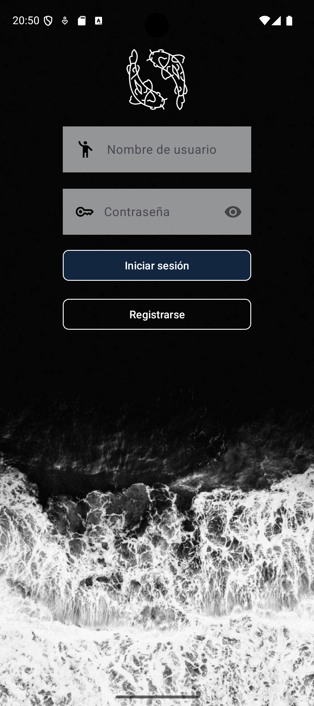 | 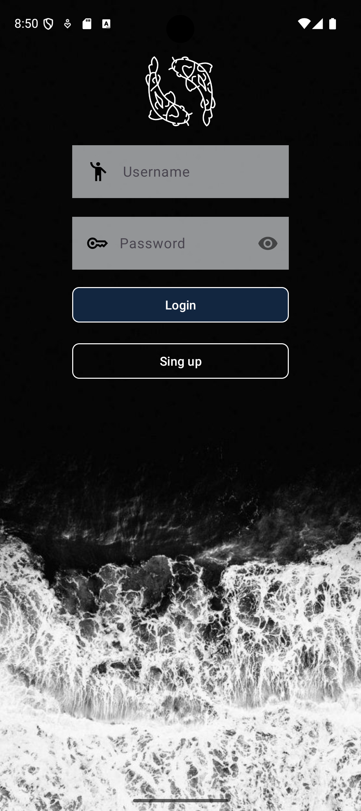 | 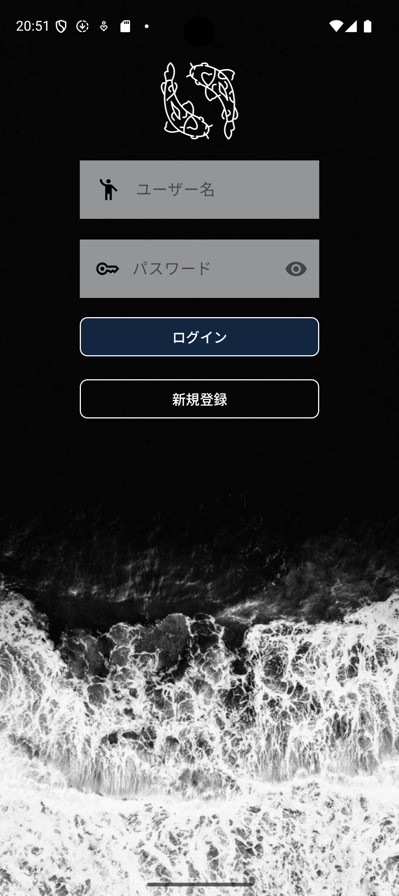 |

## Personalización
Soporte nativo para el cambio entre Modo Claro y Modo Oscuro, respetando las preferencias del sistema.

| Modo Claro | Modo Oscuro |
| :---: | :---: |
| 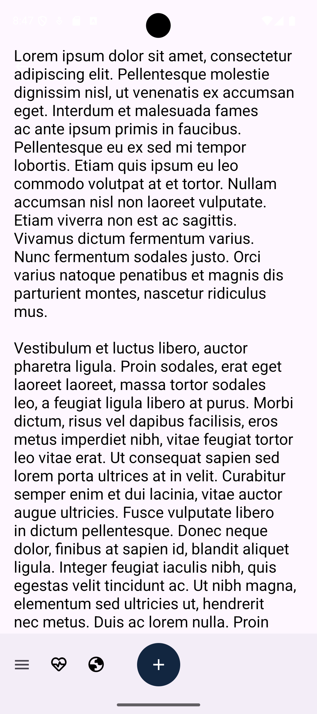 | 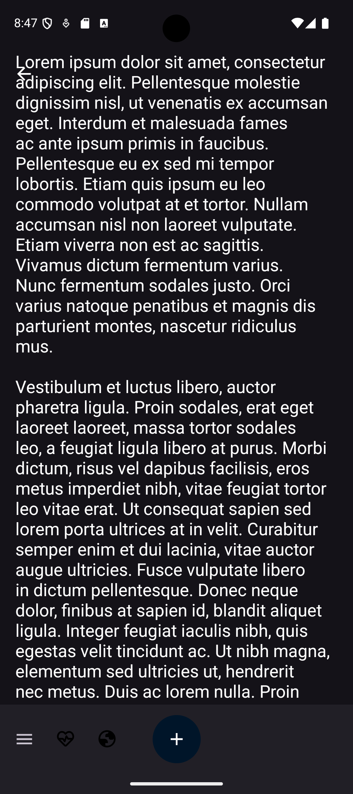 |

## Bottom app bar

| Bottom App Bar | Menú Contextual |
| :---: | :---: |
|  | 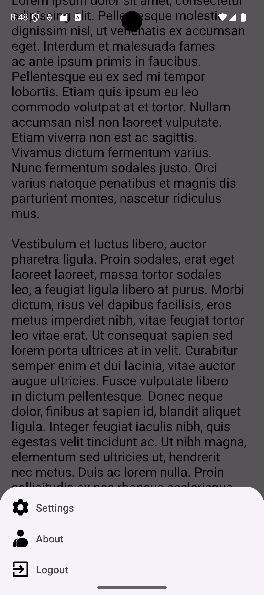 |

## Pantallas de la App

### Vista Principal y Autenticación

| Login | Sign Up |
| :---: | :---: |
| 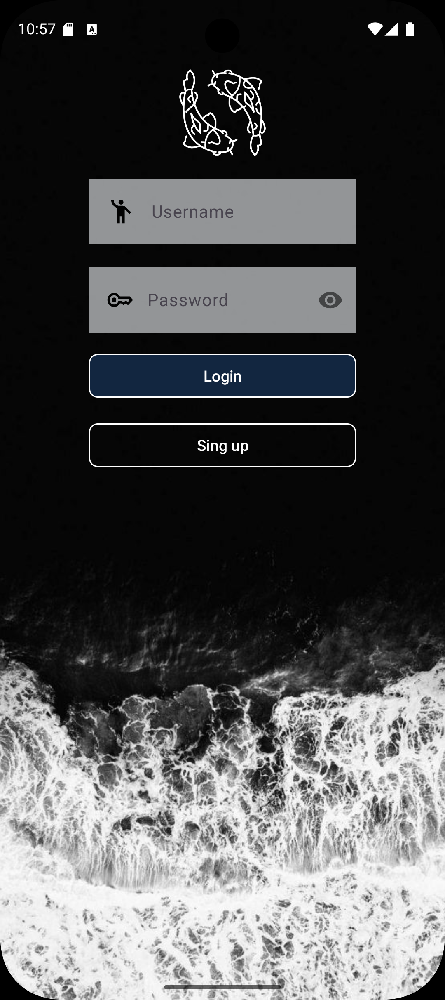 | 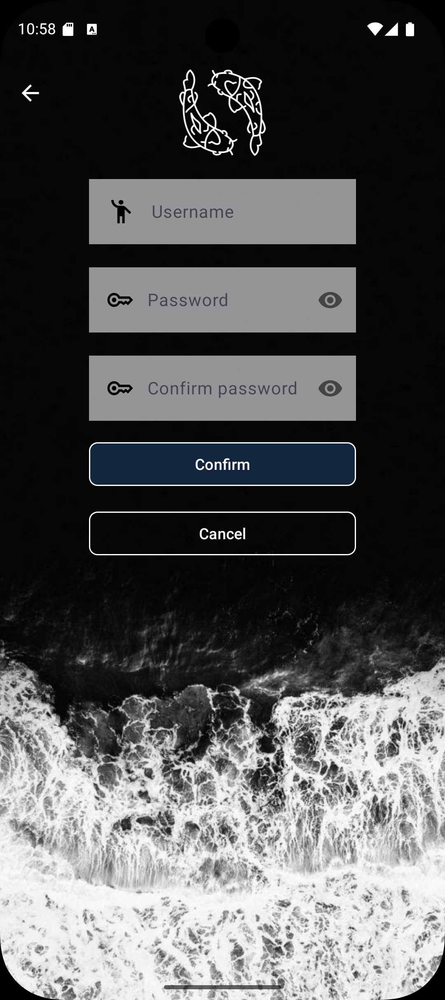 |

> **Nota:** El sistema de login valida que los campos no estén vacíos y guarda el nombre de usuario localmente para mostrarlo en el Perfil.

### Funcionalidades

| Main  | Perfil de Usuario |
| :---: | :---: |
|  | 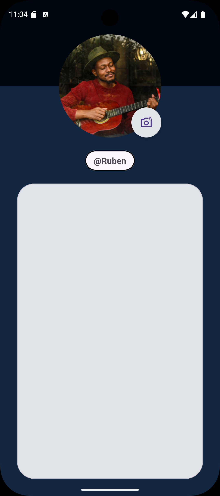 |

### Feedback y Diálogos

| Login Success | Login Error | Main Menu | Dialog Alert | Context |
| :---: | :---: | :---: | :---: |:---:|
| 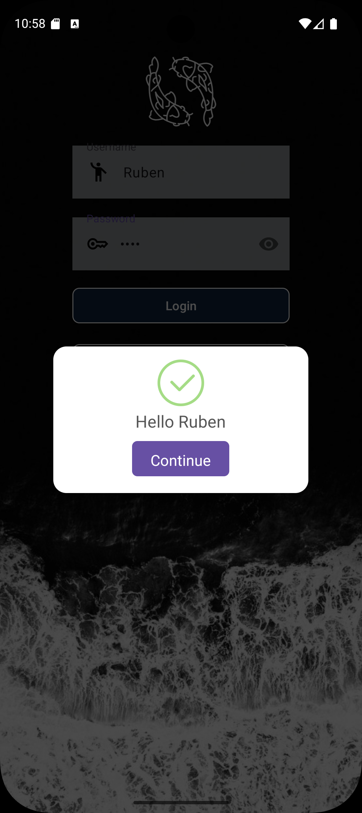 | 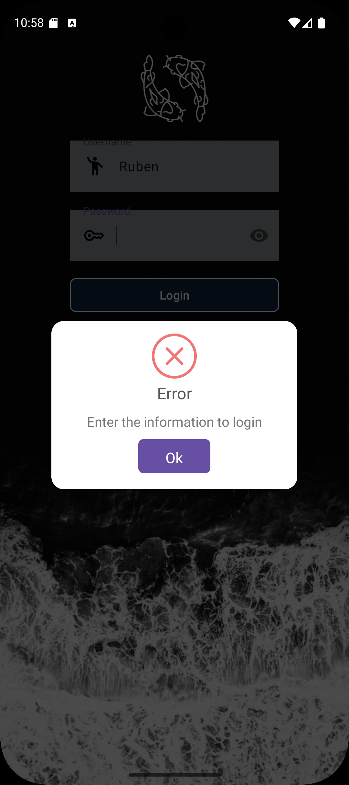 |  | 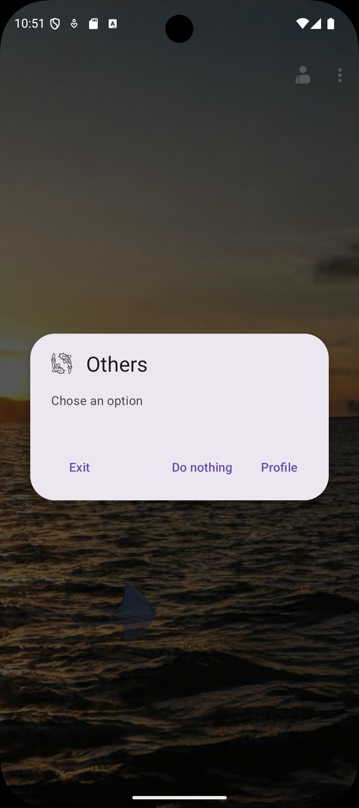 | 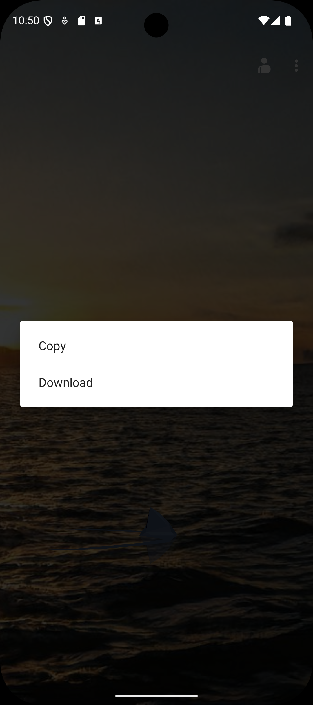 |

### Animaciones

| Lottie | Splash Screen | Refresh |
| :---: | :---: | :---: |
|  |  |  |

---

### Paleta de Colores

---

> [!NOTE]
> **Estado del proyecto**:
> Esta app es una práctica de clase que aún se encuentra en desarrollo activo.